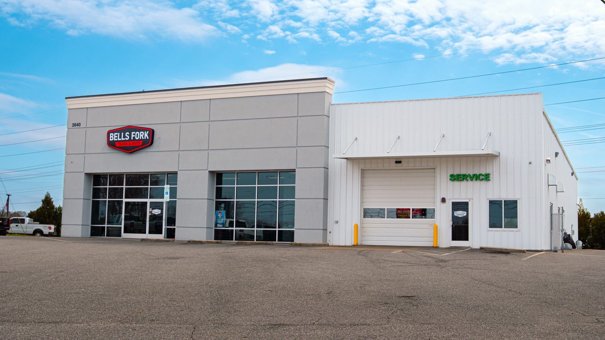

# Mobile Optimization Audit & Implementation Plan
## Bells Fork Auto & Truck — bellsforkautoandtruck.com
**Audit Date:** March 6, 2026
**Site Type:** Static HTML + Bootstrap 5 + Netlify Functions
**Current Stack:** HTML/CSS/JS, Bootstrap 5.3.3, esbuild, Netlify

---

## 1. MOBILE USABILITY ASSESSMENT

### 1.1 What's Already Done Well (Strengths)

| Feature | Status | Notes |
|---------|--------|-------|
| Viewport meta tag | All pages | `width=device-width, initial-scale=1` |
| Responsive grid | Bootstrap 5 | Full responsive column system |
| Custom breakpoints | 5 levels | 575px, 767px, 768-1024px, 991px, 1025px+ |
| Touch targets | 44-48px min | Buttons, links, form inputs all sized properly |
| iOS zoom prevention | 16px inputs | `font-size: 16px` on `.form-control` at 767px |
| Mobile action bar | Fixed bottom | Call/Text/Directions — visible on mobile only |
| Click-to-call | `tel:` links | Present across all customer-facing pages |
| Safe area insets | Bottom bar | `env(safe-area-inset-bottom)` for notched phones |
| Sticky hover fix | Touch media | `hover: none` + `pointer: coarse` media queries |
| Content visibility | CSS containment | `content-visibility: auto` for offscreen sections |
| Script loading | `defer` attr | All scripts use `defer` for non-blocking load |
| Resource hints | Preconnect | CDN and font preconnects in place |
| SEO/Schema | Comprehensive | JSON-LD structured data, OG tags, Twitter Cards |
| Form autocomplete | Extensive | Proper `autocomplete` attributes on all forms |
| Accessibility | Good | Skip link, focus-visible, high contrast, reduced motion |
| Hamburger menu | Bootstrap | Responsive navbar-toggler at 48px |

### 1.2 Critical Issues Found

#### SEVERITY: CRITICAL (Directly impacts load time & bounce rate)

**Issue #1: Massive Hero Images — 11-17 MB uncompressed**
- `shop-front.jpeg` — **11.1 MB**
- `shop-frontwithtruckszoomed.jpg` — **13.5 MB**
- `shop-frontwithtruck.jpg` — **17.4 MB**
- **Impact:** On a 3G mobile connection (1.6 Mbps), a single 11 MB image takes ~55 seconds to load. On 4G (10 Mbps), ~9 seconds. This alone destroys mobile performance scores and user experience.
- **Google Lighthouse estimate:** These images likely add 15-30+ seconds to Largest Contentful Paint (LCP) on mobile.

**Issue #2: No HTTP Caching Headers**
- `netlify.toml` has zero `[[headers]]` rules
- Static assets (images, CSS, JS, fonts) are served with default short-lived caching
- **Impact:** Every return visit re-downloads all assets. On mobile networks, this is devastating.

**Issue #3: CSS & JS Not Minified in Production Build**
- `package.json` has `build:css` and `build:js` scripts, but:
  - The `build` command runs `build:js && build:css && build:vdp`
  - HTML pages reference `style.css` (unminified), not `style.min.css`
  - Many pages load individual JS files instead of `bundle.min.js`
- **Impact:** Extra 20-40 KB of unnecessary whitespace and comments downloaded on each page load.

**Issue #4: No Responsive Images (srcset/picture)**
- Vehicle images are 300-500 KB JPEGs served at full resolution regardless of device
- No `srcset`, no `<picture>` elements, no WebP serving
- ~40 vehicles with 3-6 images each = potentially 60-120 MB of unoptimized images in the pipeline
- **Impact:** Mobile devices download desktop-sized images they'll never display at full resolution.

#### SEVERITY: HIGH (Significant UX & performance impact)

**Issue #5: Inventory JSON Loaded with `cache: 'no-store'`**
- `inventory-loader.js` line 40: `fetch(this.jsonPath, { cache: 'no-store' })`
- Forces a fresh network request on every page load
- **Impact:** Wastes bandwidth on mobile; inventory doesn't change frequently enough to justify this.

**Issue #6: No Image Placeholders or Skeleton Loading**
- Vehicle cards show empty space while images load
- No blur-up, LQIP (Low Quality Image Placeholder), or skeleton screens
- **Impact:** Layout shifts (CLS), perceived slow loading, janky user experience on slow connections.

**Issue #7: No `fetchpriority` or `decoding` Attributes on Images**
- Hero and LCP images lack `fetchpriority="high"`
- General images lack `decoding="async"`
- **Impact:** Browser can't prioritize critical images, leading to slower LCP scores.

**Issue #8: Render-Blocking CDN Resources**
- Bootstrap CSS loaded synchronously in `<head>`
- Font Awesome loaded synchronously
- No critical CSS inlined for above-the-fold content
- **Impact:** First Contentful Paint (FCP) delayed by external resource fetches.

**Issue #9: Google Maps Iframe Loading**
- Contact page and homepage load Google Maps iframe
- Some instances use `loading="lazy"`, but placement varies
- **Impact:** Maps iframe adds ~500 KB+ and delays interactivity.

#### SEVERITY: MEDIUM (UX improvements for mobile users)

**Issue #10: No Swipe Gestures on VDP Photo Gallery**
- VDP pages use basic thumbnail strip with `overflow-x: auto`
- No touch-friendly swipe/pinch-to-zoom gallery
- **Impact:** Users expect native mobile gallery experience; current UX feels dated on phones.

**Issue #11: Inventory Filtering Not Optimized for Mobile**
- Filter bar stacks to full-width on small screens (good)
- But lacks quick-tap filter chips, saved searches, or slide-up filter panel
- No "sort by" toggle visible on mobile
- **Impact:** Finding specific vehicles is harder on mobile than it needs to be.

**Issue #12: No Service Worker / Offline Support**
- `manifest.json` exists (PWA-ready) but no service worker registered
- **Impact:** Missed opportunity for asset caching, offline browsing, and "Add to Home Screen" prompt.

**Issue #13: Contact Form Missing `inputmode` on Some Fields**
- Phone fields use `type="tel"` (good) but could additionally use `inputmode="tel"`
- Email fields could benefit from `inputmode="email"` for better keyboard
- **Impact:** Minor — some Android browsers show better keyboards with explicit `inputmode`.

**Issue #14: No Preload for Critical Fonts**
- System font stack used (good!) but Bootstrap Icons font loaded via CDN
- No `<link rel="preload">` for icon font
- **Impact:** Icon font may flash or delay rendering.

---

## 2. PRIORITIZED OPTIMIZATION RECOMMENDATIONS

### Priority Matrix

| # | Optimization | Impact | Effort | Priority |
|---|-------------|--------|--------|----------|
| 1 | Compress & resize hero images | Critical | Low | **P0 — Do First** |
| 2 | Add Netlify caching headers | Critical | Low | **P0 — Do First** |
| 3 | Fix CSS/JS minification pipeline | High | Low | **P0 — Do First** |
| 4 | Add responsive images (srcset/WebP) | Critical | Medium | **P1 — Week 1** |
| 5 | Inline critical CSS | High | Medium | **P1 — Week 1** |
| 6 | Fix inventory.json caching | High | Low | **P1 — Week 1** |
| 7 | Add image placeholders/skeletons | High | Medium | **P1 — Week 1** |
| 8 | Add fetchpriority/decoding attrs | Medium | Low | **P1 — Week 1** |
| 9 | Implement swipe gallery on VDP | High | Medium | **P2 — Week 2** |
| 10 | Mobile-optimized inventory filters | High | Medium | **P2 — Week 2** |
| 11 | Register service worker | Medium | Medium | **P2 — Week 2** |
| 12 | Lazy-load Google Maps | Medium | Low | **P2 — Week 2** |
| 13 | Add preload hints for fonts/icons | Low | Low | **P3 — Week 3** |
| 14 | Add inputmode attributes | Low | Low | **P3 — Week 3** |
| 15 | Implement "Add to Home Screen" | Low | Medium | **P3 — Week 3** |

---

## 3. TECHNICAL IMPLEMENTATION GUIDELINES

### 3.1 P0 — Immediate Fixes (Day 1-2)

#### 3.1.1 Compress & Resize Hero Images

**Current state:** 11-17 MB raw JPEGs
**Target:** < 200 KB per image, with WebP versions

```bash
# Install sharp-cli or use an online tool
# Target: 1920px wide for desktop, 768px for mobile
# Quality: 80% JPEG, 75% WebP

# Example with sharp/ImageMagick:
# Desktop version
convert shop-front.jpeg -resize 1920x -quality 80 shop-front-desktop.jpg
cwebp -q 75 shop-front-desktop.jpg -o shop-front-desktop.webp

# Mobile version
convert shop-front.jpeg -resize 768x -quality 75 shop-front-mobile.jpg
cwebp -q 70 shop-front-mobile.jpg -o shop-front-mobile.webp
```

**In HTML, replace:**
```html
<!-- Before -->


<!-- After -->
<picture>
  <source media="(max-width: 768px)" srcset="assets/hero/shop-front-mobile.webp" type="image/webp">
  <source media="(max-width: 768px)" srcset="assets/hero/shop-front-mobile.jpg" type="image/jpeg">
  <source srcset="assets/hero/shop-front-desktop.webp" type="image/webp">
  
</picture>
```

#### 3.1.2 Add Netlify Caching Headers

**Add to `netlify.toml`:**
```toml
# Immutable hashed assets (if using content hashes)
[[headers]]
  for = "/assets/js/bundle.min.js"
  [headers.values]
    Cache-Control = "public, max-age=31536000, immutable"

# Images — cache for 1 year (update filenames when changed)
[[headers]]
  for = "/assets/*"
  [headers.values]
    Cache-Control = "public, max-age=2592000, stale-while-revalidate=86400"

# Vehicle images
[[headers]]
  for = "/assets/vehicles/*"
  [headers.values]
    Cache-Control = "public, max-age=2592000, stale-while-revalidate=86400"

# CSS
[[headers]]
  for = "/*.css"
  [headers.values]
    Cache-Control = "public, max-age=604800, stale-while-revalidate=86400"

# HTML — short cache with revalidation
[[headers]]
  for = "/*.html"
  [headers.values]
    Cache-Control = "public, max-age=300, stale-while-revalidate=3600"

# VDP pages
[[headers]]
  for = "/vdp/*"
  [headers.values]
    Cache-Control = "public, max-age=300, stale-while-revalidate=3600"

# Inventory JSON
[[headers]]
  for = "/inventory.json"
  [headers.values]
    Cache-Control = "public, max-age=300, stale-while-revalidate=600"
```

#### 3.1.3 Fix CSS/JS Minification Pipeline

**Update HTML pages to reference minified files:**
```html
<!-- Replace in all HTML files -->
<!-- Before -->
<link href="style.css" rel="stylesheet">
<!-- After -->
<link href="style.min.css" rel="stylesheet">
```

**Update `package.json` build command:**
```json
{
  "scripts": {
    "build": "npm run build:js && npm run build:css && npm run build:vdp"
  }
}
```

**Update `netlify.toml` build command:**
```toml
[build]
  command = "npm run build"
```

### 3.2 P1 — Week 1 Improvements

#### 3.2.1 Responsive Vehicle Images

**Option A: Build-time optimization (Recommended)**

Add an image optimization step to the build process:
```bash
npm install sharp --save-dev
```

Create `optimize-images.js`:
```javascript
// Generate multiple sizes for each vehicle image
// Sizes: 400w (mobile card), 800w (tablet/VDP thumb), 1200w (VDP main)
// Formats: original + WebP
// Output: assets/vehicles/optimized/{stocknum}-{n}-{size}.{ext}
```

**In inventory cards (inventory-loader.js):**
```html

```

#### 3.2.2 Fix Inventory JSON Caching

**In `inventory-loader.js`, change:**
```javascript
// Before
const response = await fetch(this.jsonPath, { cache: 'no-store' });

// After — use default caching, rely on server Cache-Control headers
const response = await fetch(this.jsonPath);
```

#### 3.2.3 Inline Critical CSS

Extract the above-the-fold CSS (~3-5 KB) and inline it in `<head>`:
```html
<style>
  /* Critical CSS: top-bar, navbar, hero section */
  :root { --brand-primary:#dc3545; --brand-dark:#1a1d23; }
  body { font-family:-apple-system,BlinkMacSystemFont,"Segoe UI",Roboto,sans-serif; }
  .top-bar { background:var(--brand-dark); font-size:.875rem; }
  header.navbar { background:rgba(255,255,255,.98); padding:1rem 0; }
  .hero { background:linear-gradient(135deg,#1a1d23,#2d3239); color:white; min-height:600px; }
  /* ... remainder of above-fold styles */
</style>
<link rel="preload" href="style.min.css" as="style" onload="this.onload=null;this.rel='stylesheet'">
<noscript><link href="style.min.css" rel="stylesheet"></noscript>
```

#### 3.2.4 Image Skeleton Loading

**Add CSS skeleton for image containers:**
```css
.inventory-img-wrap {
  background: linear-gradient(90deg, #f0f0f0 25%, #e0e0e0 50%, #f0f0f0 75%);
  background-size: 200% 100%;
  animation: shimmer 1.5s ease-in-out infinite;
  min-height: 200px; /* Prevent CLS */
}

@keyframes shimmer {
  0% { background-position: 200% 0; }
  100% { background-position: -200% 0; }
}

.inventory-img-wrap img {
  opacity: 0;
  transition: opacity 0.3s;
}

.inventory-img-wrap img.loaded {
  opacity: 1;
}
```

**In JS (inventory-loader.js), add to card rendering:**
```javascript
// Add load handler to reveal images smoothly
img.onload = function() { this.classList.add('loaded'); };
```

### 3.3 P2 — Week 2 Enhancements

#### 3.3.1 Swipe Gallery for VDP Pages

**Recommended library:** [Swiper.js](https://swiperjs.com/) (lightweight, touch-optimized)

```html
<!-- Add to VDP template in generate-vdp.js -->
<link rel="stylesheet" href="https://cdn.jsdelivr.net/npm/swiper@11/swiper-bundle.min.css">

<div class="swiper vdp-gallery">
  <div class="swiper-wrapper">
    <!-- Each photo as a slide -->
    <div class="swiper-slide">
      
    </div>
  </div>
  <div class="swiper-pagination"></div>
  <div class="swiper-button-prev d-none d-md-flex"></div>
  <div class="swiper-button-next d-none d-md-flex"></div>
</div>

<script src="https://cdn.jsdelivr.net/npm/swiper@11/swiper-bundle.min.js" defer></script>
<script>
  new Swiper('.vdp-gallery', {
    loop: true,
    pagination: { el: '.swiper-pagination', clickable: true },
    navigation: { nextEl: '.swiper-button-next', prevEl: '.swiper-button-prev' },
    lazy: true,
    touchRatio: 1.5, // More responsive to touch
    threshold: 5,     // Minimum swipe distance
  });
</script>
```

#### 3.3.2 Mobile Inventory Filters

**Implement a slide-up filter panel:**
```html
<!-- Mobile filter trigger (visible < 768px) -->
<button class="btn btn-accent d-md-none w-100 mb-3" id="mobileFilterToggle">
  <i class="bi bi-funnel"></i> Filter Vehicles
</button>

<!-- Quick-tap filter chips -->
<div class="d-flex flex-wrap gap-2 mb-3 d-md-none" id="quickFilters">
  <button class="chip-filter active" data-filter="all">All</button>
  <button class="chip-filter" data-filter="truck">Trucks</button>
  <button class="chip-filter" data-filter="suv">SUVs</button>
  <button class="chip-filter" data-filter="car">Cars</button>
</div>

<!-- Sort toggle -->
<select class="form-select d-md-none mb-3" id="mobileSortBy">
  <option value="newest">Newest First</option>
  <option value="price-low">Price: Low to High</option>
  <option value="price-high">Price: High to Low</option>
  <option value="mileage">Lowest Mileage</option>
</select>
```

**CSS for filter chips:**
```css
.chip-filter {
  padding: 0.5rem 1rem;
  border-radius: 999px;
  border: 1px solid var(--brand-primary);
  background: transparent;
  color: var(--brand-primary);
  font-weight: 600;
  font-size: 0.875rem;
  min-height: 44px;
}

.chip-filter.active {
  background: var(--brand-primary);
  color: white;
}
```

#### 3.3.3 Service Worker Registration

**Create `sw.js` in root:**
```javascript
const CACHE_NAME = 'bfat-v1';
const PRECACHE = [
  '/',
  '/style.min.css',
  '/assets/js/bundle.min.js',
  '/assets/logo.webp',
  '/assets/favicon.png',
];

self.addEventListener('install', (e) => {
  e.waitUntil(caches.open(CACHE_NAME).then(c => c.addAll(PRECACHE)));
});

self.addEventListener('fetch', (e) => {
  // Stale-while-revalidate for HTML, network-first for API
  if (e.request.url.includes('.netlify/functions')) return;

  e.respondWith(
    caches.match(e.request).then(cached => {
      const fetched = fetch(e.request).then(response => {
        const clone = response.clone();
        caches.open(CACHE_NAME).then(c => c.put(e.request, clone));
        return response;
      });
      return cached || fetched;
    })
  );
});
```

**Register in all pages (before `</body>`):**
```html
<script>
  if ('serviceWorker' in navigator) {
    navigator.serviceWorker.register('/sw.js');
  }
</script>
```

### 3.4 P3 — Week 3 Polish

#### 3.4.1 Preload Critical Resources

```html
<!-- Add to <head> of all pages -->
<link rel="preload" href="https://cdn.jsdelivr.net/npm/bootstrap-icons@1.11.3/font/bootstrap-icons.min.css" as="style">
```

#### 3.4.2 Add `inputmode` Attributes

```html
<!-- Phone fields -->
<input type="tel" inputmode="tel" autocomplete="tel" ...>

<!-- Email fields -->
<input type="email" inputmode="email" autocomplete="email" ...>

<!-- ZIP code fields -->
<input type="text" inputmode="numeric" pattern="[0-9]*" autocomplete="postal-code" ...>
```

#### 3.4.3 Enhanced PWA Support

**Update `manifest.json`:**
```json
{
  "name": "Bells Fork Auto & Truck",
  "short_name": "Bells Fork",
  "start_url": "/",
  "display": "standalone",
  "background_color": "#1a1d23",
  "theme_color": "#dc3545",
  "icons": [
    { "src": "/assets/icon-192.png", "sizes": "192x192", "type": "image/png" },
    { "src": "/assets/icon-512.png", "sizes": "512x512", "type": "image/png" }
  ]
}
```

---

## 4. EXPECTED TIMELINE

| Phase | Duration | Items | Dependencies |
|-------|----------|-------|--------------|
| **P0: Critical Fixes** | Days 1-2 | Image compression, caching headers, minification | None |
| **P1: Performance** | Days 3-7 | Responsive images, critical CSS, skeletons, caching fix | P0 complete |
| **P2: UX Enhancements** | Days 8-14 | Swipe gallery, mobile filters, service worker, lazy Maps | P1 complete |
| **P3: Polish** | Days 15-21 | Preloads, inputmode, PWA icons | P2 complete |
| **Testing & QA** | Days 22-25 | Cross-device testing, Lighthouse audits | All phases |

**Total estimated timeline: 3-4 weeks**

---

## 5. SUCCESS METRICS TO TRACK POST-IMPLEMENTATION

### 5.1 Core Web Vitals (Google Lighthouse Mobile)

| Metric | Current (Est.) | Target | Tool |
|--------|---------------|--------|------|
| **LCP** (Largest Contentful Paint) | >10s | <2.5s | Lighthouse, PageSpeed Insights |
| **FID/INP** (Interaction to Next Paint) | Unknown | <200ms | Chrome UX Report |
| **CLS** (Cumulative Layout Shift) | >0.2 | <0.1 | Lighthouse |
| **FCP** (First Contentful Paint) | >5s | <1.8s | Lighthouse |
| **TTI** (Time to Interactive) | >10s | <3.8s | Lighthouse |
| **Total Page Weight** | >15 MB | <1.5 MB | DevTools Network |
| **Lighthouse Mobile Score** | ~20-30 | 85+ | Lighthouse |

### 5.2 Business Metrics

| Metric | How to Measure | Target Improvement |
|--------|---------------|-------------------|
| **Mobile bounce rate** | Google Analytics | -30% reduction |
| **Mobile session duration** | Google Analytics | +40% increase |
| **Inventory page views/session** | Google Analytics | +25% increase |
| **VDP views from mobile** | Google Analytics | +35% increase |
| **Contact form submissions (mobile)** | Form tracking | +20% increase |
| **Click-to-call rate** | Analytics events | +15% increase |
| **Mobile conversion rate** | Lead tracking | +25% increase |

### 5.3 Monitoring Tools

- **Google PageSpeed Insights** — Run monthly audits on homepage, inventory, and VDP pages
- **Google Search Console** — Monitor Core Web Vitals report for mobile
- **Netlify Analytics** — Track bandwidth usage (should decrease after optimization)
- **Real User Monitoring** — Consider adding a lightweight RUM script to track actual user performance

### 5.4 Testing Checklist

- [ ] Test on iPhone SE (small screen, 375px)
- [ ] Test on iPhone 14/15 (standard, 390px)
- [ ] Test on Samsung Galaxy S series
- [ ] Test on iPad (768px)
- [ ] Test on slow 3G connection (Chrome DevTools throttling)
- [ ] Test on fast 3G / slow 4G connection
- [ ] Verify click-to-call works on all pages
- [ ] Verify Google Maps directions link works
- [ ] Verify all forms submit correctly on mobile
- [ ] Verify VDP photo gallery swipe works
- [ ] Verify inventory filters work on small screens
- [ ] Verify no horizontal overflow/scroll on any page
- [ ] Run Lighthouse audit on all key pages (score > 85)

---

## APPENDIX: File Reference

| File | Purpose | Mobile Issues |
|------|---------|---------------|
| `style.css` (821 lines) | Global styles | Good responsive CSS; needs minification |
| `index.html` | Homepage | 11 MB hero image; needs image optimization |
| `inventory.html` | Vehicle listing | Needs mobile filter chips & sort |
| `contact.html` | Contact page | Form works well; add inputmode attrs |
| `generate-vdp.js` | VDP generator | Needs swipe gallery, responsive images |
| `inventory-loader.js` | Inventory renderer | Needs image skeletons, fix cache: no-store |
| `netlify.toml` | Server config | Missing all caching headers |
| `assets/vehicles/` | Vehicle photos | 300-500 KB each; needs WebP + srcset |
| `assets/shop-front.*` | Hero images | 11-17 MB; needs compression to <200 KB |
